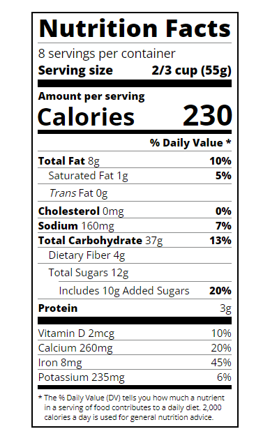

# Nutrition Label

Project from the explorer track at the NLW-SETUP event, organized by Rocketseat.

🔗 [Click here to access](https://carvmi.github.io/typography/)

## Technologies 
- HTML
- CSS
## What I have learned
- The letter-spacing property can be used to adjust the space between each character of text in an element.
- Span elements can increase the readability of your text by giving horizontal spacing between equally important elements.
- All dividers have the border-bottom as solid, however, they have diferent height.
- Creatting multiple dividers is necessary to apply specific classes to style them individually.
- The text-indent CSS property sets the length of empty space (indentation) that is put before lines of text in a block.

## Contact
milenadecarvalho2000@gmail.com
